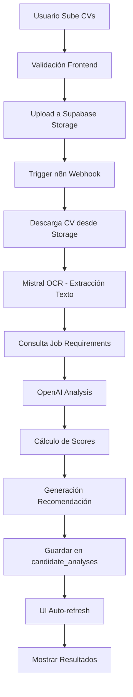

# 🤖 RecruitAgent AI

**Plataforma de Reclutamiento Inteligente con Análisis de CVs por IA**

RecruitAgent AI es una aplicación web moderna que revoluciona el proceso de reclutamiento mediante el análisis automatizado de CVs usando Inteligencia Artificial. La plataforma permite a los reclutadores crear trabajos, definir requisitos específicos y analizar candidatos de manera eficiente y precisa.


## 🌟 Características Principales

### 🎯 **Gestión de Trabajos Completa**
- **Crear Trabajos**: Formulario completo con información detallada del puesto
- **Gestión de Skills**: Sistema avanzado para definir habilidades requeridas con niveles de importancia
- **Estados de Trabajo**: Control de estado (activo/inactivo) para gestionar vacantes
- **Edición Completa**: Modificación de trabajos existentes con persistencia en tiempo real

### 🧠 **Análisis Inteligente de CVs**
- **Procesamiento Automatizado**: Integración con n8n workflows para análisis mediante IA
- **OCR Avanzado**: Extracción de texto de PDFs usando Mistral OCR
- **Análisis por IA**: Evaluación detallada usando OpenAI GPT-4
- **Scoring Multicriteria**: Puntuación técnica, experiencia y educación
- **Recomendaciones**: Decisiones automatizadas (Viable/No Viable/En Análisis)

### 📊 **Dashboard Analytics**
- **Estadísticas en Tiempo Real**: Trabajos activos, CVs analizados, promedio de match
- **Trabajos Recientes**: Vista rápida de las últimas vacantes creadas
- **Contadores Dinámicos**: Número de candidatos por trabajo actualizado automáticamente
- **Métricas de Rendimiento**: Seguimiento del éxito del proceso de reclutamiento

### 💫 **Experiencia de Usuario Superior**
- **Interfaz Moderna**: Diseño glassmorphism con Tailwind CSS
- **Notificaciones Inteligentes**: Sistema de alertas con auto-eliminación
- **Navegación Intuitiva**: Menú lateral organizado por flujo de trabajo
- **Responsive Design**: Optimizado para desktop, tablet y móvil

## 🏗️ Arquitectura del Sistema

### **Frontend (React + TypeScript)**
```
src/
├── components/           # Componentes React
│   ├── Dashboard.tsx     # Panel principal con estadísticas
│   ├── CreateJobForm.tsx # Formulario de creación de trabajos
│   ├── JobsList.tsx      # Lista y edición de trabajos
│   ├── CVAnalysis.tsx    # Análisis y subida de CVs
│   ├── LandingPage.tsx   # Página de presentación
│   └── AuthModal.tsx     # Sistema de autenticación
├── contexts/             # Estado global
│   └── JobsContext.tsx   # Gestión de trabajos y candidatos
├── hooks/                # Hooks personalizados
│   └── useAuth.ts        # Autenticación con Supabase
├── config/               # Configuraciones
│   └── n8n.ts           # Configuración de workflows
└── lib/                  # Librerías y utilidades
    └── supabase.ts      # Cliente de Supabase
```

### **Backend (Supabase + PostgreSQL)**
```sql
-- Estructura principal de base de datos
├── recruiters           # Información de reclutadores
├── jobs                 # Trabajos/vacantes
├── job_required_skills  # Habilidades requeridas por trabajo
├── candidates           # Información de candidatos
└── candidate_analyses   # Análisis detallados de CVs
```

### **Automatización (n8n + IA)**
```
Workflow de Procesamiento:
1. 📤 Upload CV → Supabase Storage
2. 🔗 Webhook Trigger → n8n Workflow
3. 📄 Mistral OCR → Extracción de texto
4. 🤖 OpenAI GPT-4 → Análisis inteligente
5. 💾 Supabase → Persistencia de resultados
6. ✅ UI Update → Actualización en tiempo real
```

## 🚀 Funcionalidades Detalladas

### **1. Sistema de Autenticación**
- Integración completa con Supabase Auth
- Soporte para email/password y proveedores OAuth
- Gestión de sesiones persistentes
- Row Level Security (RLS) para seguridad de datos

### **2. Gestión de Trabajos**
#### Creación de Trabajos
- **Información Básica**: Título, descripción, empresa, ubicación
- **Detalles del Puesto**: Tipo de trabajo, nivel de experiencia, rango salarial
- **Requisitos**: Descripción detallada de responsabilidades
- **Skills Management**: Sistema avanzado para definir habilidades

#### Sistema de Skills
```typescript
interface JobSkill {
  skill_name: string;         // Nombre de la habilidad
  skill_category: string;     // Categoría (Frontend, Backend, etc.)
  importance_level: number;   // Nivel 1-5
  is_mandatory: boolean;      // Obligatoria o deseable
  min_years: number;         // Años mínimos de experiencia
}
```

### **3. Análisis de CVs**
#### Validación de Archivos
- **Formatos**: PDF, DOC, DOCX
- **Tamaño Máximo**: 10MB por archivo
- **Validación**: Tipo MIME y extensión
- **Sanitización**: Nombres de archivo seguros

#### Procesamiento por Lotes
```typescript
const PROCESSING_CONFIG = {
  BATCH_SIZE: 3,        // Archivos en paralelo
  BATCH_DELAY: 1500,    // ms entre lotes
  TIMEOUT: 120000,      // 2 minutos por archivo
  AUTO_RELOAD: 4000     // ms para actualizar UI
}
```

#### Scoring y Análisis
```typescript
interface CandidateAnalysis {
  overall_score: number;           // Puntuación general (0-100)
  match_percentage: number;        // Porcentaje de match
  technical_score: number;         // Score técnico
  experience_score: number;        // Score de experiencia
  education_score: number;         // Score educativo
  strengths: string[];            // Fortalezas identificadas
  improvement_areas: string[];     // Áreas de mejora
  missing_skills: string[];       // Skills faltantes
  exceeded_requirements: string[]; // Requisitos superados
  recommendation: string;          // Recomendación final
}
```

### **4. Sistema de Notificaciones**
```typescript
interface Notification {
  type: 'success' | 'error' | 'warning' | 'info';
  title: string;
  message: string;
  // Auto-eliminación después de 3 segundos
}
```

## 🛠️ Instalación y Configuración

### **Prerrequisitos**
- Node.js 18+ y npm/yarn
- Cuenta de Supabase configurada
- n8n instance con workflows configurados

### **1. Clonar e Instalar**
```bash
git clone [repository-url]
cd recruitment-ai
npm install
```

### **2. Variables de Entorno**
Crear archivo `.env` en la raíz del proyecto:
```env
VITE_SUPABASE_URL=your_supabase_url
VITE_SUPABASE_ANON_KEY=your_supabase_anon_key
```

### **3. Configuración de Base de Datos**
```sql
-- Crear tablas principales (esquema en docs/database-schema.sql)
CREATE TABLE recruiters (...);
CREATE TABLE jobs (...);
CREATE TABLE job_required_skills (...);
CREATE TABLE candidates (...);
CREATE TABLE candidate_analyses (...);

-- Configurar Row Level Security
ALTER TABLE jobs ENABLE ROW LEVEL SECURITY;
-- ... políticas de seguridad
```

### **4. Configuración de n8n Workflows**
- Importar workflow desde `docs/n8n-workflow.json`
- Configurar credenciales de Supabase y OpenAI
- Activar webhook endpoint: `/webhook/process-cv`

### **5. Ejecutar Aplicación**
```bash
# Desarrollo
npm run dev

# Producción
npm run build
npm run preview
```

## 📊 Flujo de Procesamiento de CVs



## 🔧 Configuración Avanzada

### **Configuración de n8n (src/config/n8n.ts)**
```typescript
export const N8N_CONFIG = {
  WEBHOOK_BASE_URL: 'https://your-n8n-instance.com/webhook',
  FILE_UPLOAD: {
    MAX_SIZE: 10 * 1024 * 1024,
    ALLOWED_TYPES: ['application/pdf', /* ... */],
  },
  PROCESSING: {
    BATCH_SIZE: 3,
    BATCH_DELAY: 1500,
    WEBHOOK_TIMEOUT: 120000,
  }
};
```

### **Configuración de Supabase Storage**
```javascript
// Bucket para CVs
const cvBucket = 'candidate-cvs';
// Políticas de acceso RLS aplicadas
```

## 📈 Métricas y Rendimiento

### **Performance Benchmarks**
- **Throughput**: ~3 CVs por minuto
- **Latency**: 30-60 segundos por CV
- **Accuracy**: >90% para CVs bien estructurados
- **Success Rate**: >95% para archivos válidos

### **Optimizaciones Implementadas**
- ⚡ Procesamiento en batches paralelos
- 🧠 Memoización de trabajos activos
- 🔄 Auto-actualización inteligente
- 📦 Lazy loading de componentes
- 🎯 Queries optimizadas con JOIN

## 🛡️ Seguridad

### **Medidas de Seguridad Implementadas**
- 🔐 **Row Level Security**: Datos aislados por recruiter
- 🔍 **Validación Estricta**: Tipos de archivo y tamaños
- 🧹 **Sanitización**: Nombres de archivo seguros
- ⏱️ **Timeouts**: Prevención de colgadas
- 📝 **Logging**: Auditoría completa de operaciones

## 🤝 Contribución

### **Estructura de Commits**
```
feat: nueva funcionalidad
fix: corrección de bugs
docs: documentación
style: formateo
refactor: reestructuración
test: pruebas
chore: mantenimiento
```

### **Workflow de Desarrollo**
1. **Fork** del repositorio
2. **Branch** para nueva feature
3. **Commits** atómicos y descriptivos
4. **Testing** antes de PR
5. **Pull Request** con descripción detallada

## 📚 Documentación Adicional

- 📖 [Integración CV Upload](docs/CV_UPLOAD_INTEGRATION.md)
- 🗄️ [Esquema de Base de Datos](docs/database-schema.sql)
- 🔄 [n8n Workflows](docs/n8n-workflow.json)
- 🎨 [Guía de Componentes](docs/components-guide.md)

## 🆘 Soporte y Troubleshooting

### **Problemas Comunes**
1. **CVs no se procesan**: Verificar configuración de webhook n8n
2. **Contadores en 0**: Ejecutar `refreshStats()` manualmente
3. **Skills no se guardan**: Verificar RLS policies en Supabase
4. **Timeouts**: Aumentar límites en configuración n8n

### **Debugging**
```bash
# Logs del cliente
console.log('🚀 Estado del procesamiento:', progress);

# Verificar Supabase
SELECT * FROM candidate_analyses WHERE job_id = 123;

# Logs de n8n workflow
Check executions in n8n dashboard
```

---

**Desarrollado con ❤️ para revolucionar el reclutamiento con IA**

Para más información, contactar: [tu-email@example.com]
