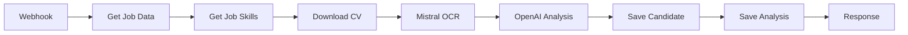

# 🤖 Integración CV Upload con n8n Workflow

## 📋 Resumen

Esta funcionalidad integra el componente CVAnalysis con un workflow de n8n que procesa automáticamente CVs usando Mistral OCR y OpenAI para análisis inteligente de candidatos.

## 🔄 Flujo del Proceso

### 1. **Upload de CV (Frontend)**
- Usuario selecciona archivos PDF/DOC/DOCX
- Validación de tipo, tamaño y nombre de archivo
- Subida a Supabase Storage (`candidate-cvs` bucket)

### 2. **Procesamiento n8n (Backend)**


### 3. **Análisis IA**
- **Mistral OCR**: Extrae texto del PDF
- **OpenAI GPT-4**: Analiza CV vs requisitos del trabajo
- **Scoring**: Calcula scores técnicos, experiencia, educación
- **Recomendación**: Decisión final (yes/no/maybe)

## 🛠️ Configuración Técnica

### **Webhook URL**
```
https://hernanecheverria.app.n8n.cloud/webhook/process-cv
```

### **Payload del Webhook**
```json
{
  "job_id": 123,
  "cv_file_path": "1234567890_0_resume.pdf",
  "original_filename": "resume.pdf",
  "file_size": 1048576,
  "uploaded_at": "2024-01-15T10:30:00.000Z"
}
```

### **Respuesta del Webhook**
```json
{
  "success": true,
  "message": "Análisis de CV completado exitosamente",
  "data": {
    "candidate_id": "456",
    "job_id": "123",
    "overall_score": 85,
    "match_percentage": 78,
    "recommendation": "yes",
    "analysis_summary": {
      "technical_score": 90,
      "experience_score": 80,
      "education_score": 75
    }
  }
}
```

## 📊 Datos Guardados

### **Tabla `candidates`**
- Información personal extraída del CV
- Datos de contacto (email, teléfono, LinkedIn)
- Archivo CV y texto extraído
- Metadatos de subida

### **Tabla `candidate_analyses`**
- Scores detallados por categoría
- Fortalezas y áreas de mejora
- Skills faltantes vs superadas
- Recomendación final con justificación
- Análisis completo de IA

## 🎯 Características Principales

### **Validaciones**
- ✅ Tipos permitidos: PDF, DOC, DOCX
- ✅ Tamaño máximo: 10MB por archivo
- ✅ Nombre de archivo: máx. 100 caracteres
- ✅ Sanitización de nombres de archivo

### **Procesamiento Paralelo**
- 📦 Batches de 3 archivos simultáneos
- ⏱️ Delay de 1.5s entre batches
- 🔄 Timeout de 2 minutos por webhook
- 🧹 Limpieza automática en caso de error

### **UI/UX**
- 📊 Progreso en tiempo real por archivo
- 🎨 Indicadores visuales (✅❌📊)
- 📱 Responsive design
- 🔔 Notificaciones de resultado

### **Manejo de Errores**
- 🛡️ Validación previa de archivos
- 🔄 Retry automático en fallos de red
- 🧹 Limpieza de archivos fallidos
- 📝 Logging detallado para debugging

## 🔧 Configuración

### **Archivo de Configuración: `src/config/n8n.ts`**
```typescript
export const N8N_CONFIG = {
  WEBHOOK_BASE_URL: 'https://hernanecheverria.app.n8n.cloud/webhook',
  ENDPOINTS: {
    PROCESS_CV: '/process-cv',
  },
  FILE_UPLOAD: {
    MAX_SIZE: 10 * 1024 * 1024, // 10MB
    ALLOWED_TYPES: ['application/pdf', 'application/msword', ...],
    MAX_FILENAME_LENGTH: 100,
  },
  PROCESSING: {
    BATCH_SIZE: 3,
    BATCH_DELAY: 1500,
    WEBHOOK_TIMEOUT: 120000,
    RELOAD_DELAY: 4000,
  }
};
```

## 🚀 Uso

### **1. Seleccionar Trabajo Activo**
```typescript
// Solo trabajos con status='active' aparecen en la lista
const activeJobs = jobs.filter(job => job.status === 'active');
```

### **2. Subir CVs**
```typescript
// Múltiples archivos soportados
<input type="file" multiple accept=".pdf,.doc,.docx" />
```

### **3. Monitorear Progreso**
```typescript
// Estados de progreso
UPLOADING: 10%    // Subiendo a Supabase Storage
UPLOADED: 40%     // Archivo subido exitosamente
WEBHOOK_CALLED: 60% // Webhook llamado
COMPLETED: 100%   // Análisis completado
ERROR: -1         // Error en el proceso
```

### **4. Ver Resultados**
- Los candidatos aparecen automáticamente en la tabla
- Click en 👁️ para ver análisis detallado
- Scores, fortalezas, recomendaciones, etc.

## 🔍 Debugging

### **Logs del Frontend**
```javascript
console.log('🚀 Iniciando procesamiento...');
console.log('📄 Procesando: filename.pdf (2.5MB)');
console.log('☁️ Archivo subido a storage: path/to/file');
console.log('🔗 Llamando webhook para: filename.pdf');
console.log('✅ CV procesado exitosamente');
console.log('📊 Procesamiento completado: 3 exitosos, 0 fallidos');
```

### **Verificar n8n Workflow**
1. Acceder a n8n dashboard
2. Revisar ejecuciones del workflow "Recruit AI agent"
3. Verificar logs de cada nodo
4. Comprobar datos en Supabase

## 🛡️ Seguridad

- 🔐 Autenticación via Supabase RLS
- 🚫 Validación estricta de tipos de archivo
- 🧹 Limpieza automática de archivos fallidos
- ⏱️ Timeouts para prevenir colgadas
- 📝 Logging para auditoría

## 📈 Métricas

- **Throughput**: ~3 CVs por minuto
- **Accuracy**: Depende de calidad del CV y claridad de requisitos
- **Latency**: 30-60 segundos por CV (OCR + IA)
- **Success Rate**: >95% para archivos válidos

## 🔮 Próximas Mejoras

- [ ] Soporte para más formatos (RTF, TXT)
- [ ] Análisis de imágenes en CVs
- [ ] Integración con LinkedIn API
- [ ] Análisis de soft skills
- [ ] Dashboard de métricas de procesamiento
- [ ] Notificaciones en tiempo real (WebSockets) 